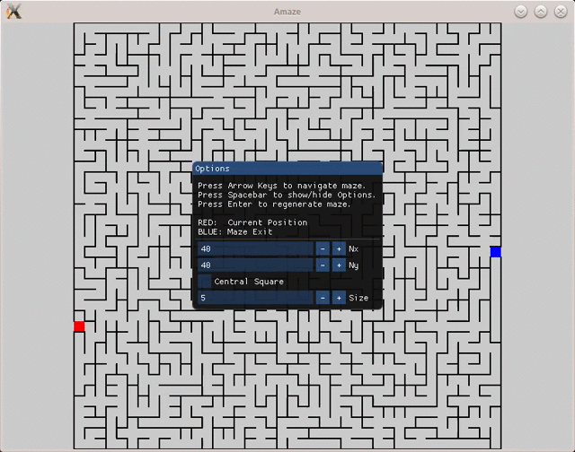

# amaze
A random maze generator.
Mazes have one entrance and one exit, and can be navigated with arrow keys.

Instructions to build:
- make

Otherwise using cmake:
- mkdir build
- cd build
- cmake ..
- make

